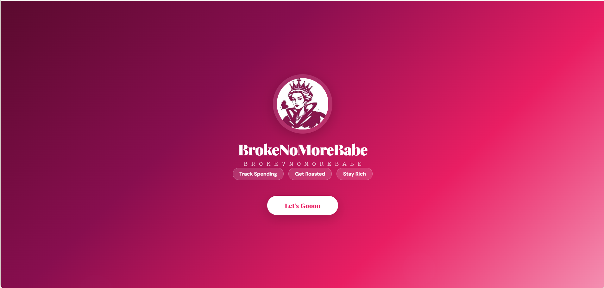
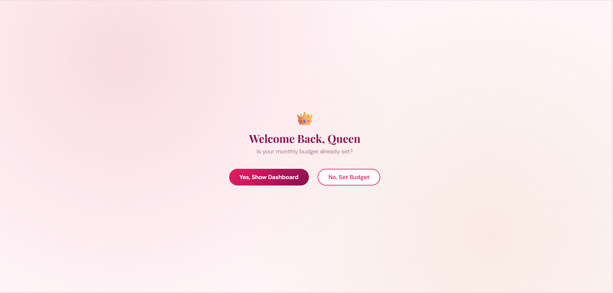
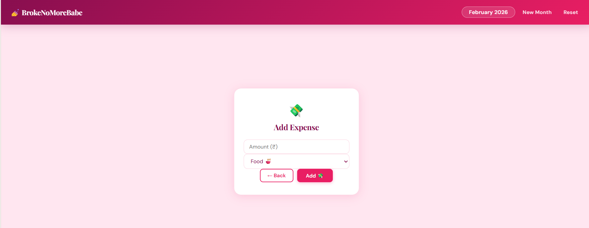
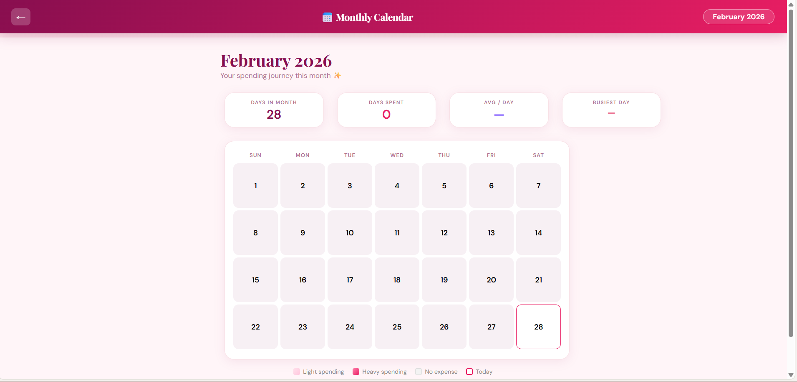
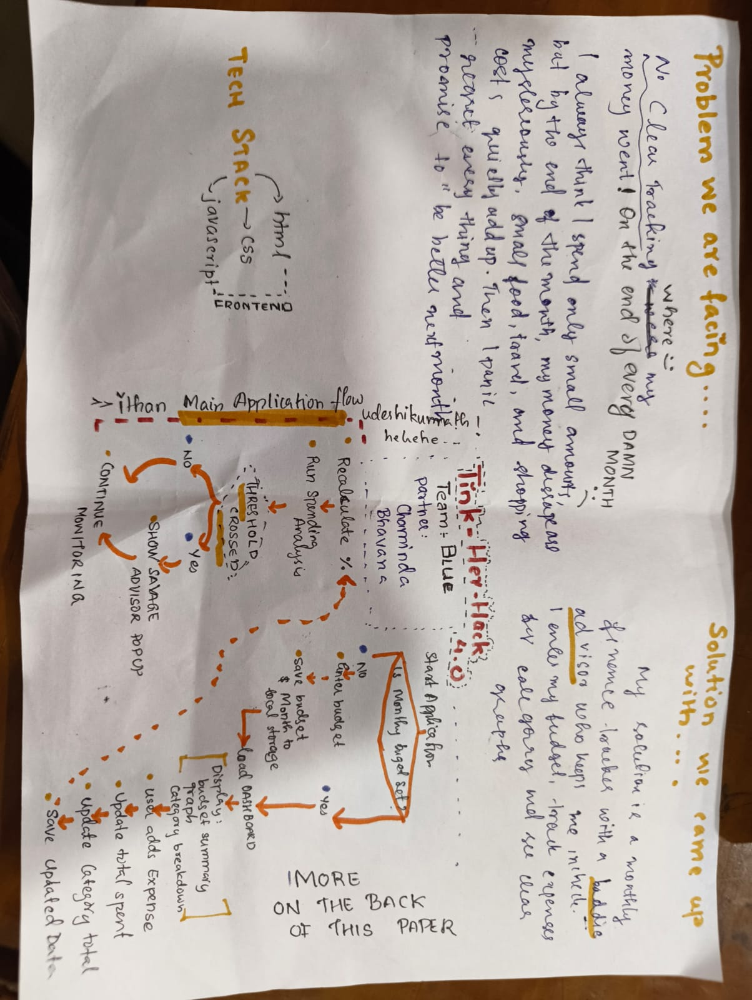

<p align="center">
  
</p>

# BrokeNoMoreBabe

## Basic Details

### Team Name: Blue

### Team Members
- Member 1: Bhavana B - College of Engineering Perumon
- Member 2: Chaminda Satheesh - College of Engineering Perumon

### Hosted Project Link
https://broke-no-more-babe.vercel.app/

### Project Description


### The Problem statement
We’re college students, and somehow the money disappears before the month ends. 💸 We don’t really know where it all went—food, outings, shopping… it just adds up. By the time we check, we’re already broke. The finance apps out there feel like boring spreadsheets and don’t really relate to how we spend.

### The Solution

We wanted something that actually speaks our language. BrokeNoMoreBabe is a fun, student-friendly budgeting app that:
Lets us set a monthly budget
Tracks spending category-wise (Dress, Food, Travel, Academic…)
Shows a visual dashboard so we can see where the money’s going
Features a Savage Baddie Advisor that pops up and roasts us when we overspend
It turns boring budgeting into something interactive, relatable, and even entertaining like having a brutally honest friend keeping us in check.

## Technical Details

HTML, CSS, JS , Chart.js, localStorage, deployed on Vercel. No backend, no database—fully frontend.Since we have no much knowledge about those🥲

### Technologies/Components Used

**For Software:**
- Languages used: HTML5, CSS3, JavaScript
- Frameworks used: None
- Libraries used:Chart.js
- Tools used: VS Code, Git, Vercel

## Features

List the key features of your project:


- Feature 1:Monthly Budget Entry – Users must enter their monthly budget, which forms the baseline for all tracking and analysis.

- Feature 2:Category-wise Expense Tracking – Track spending in multiple categories (Dress, Food, Travel, Academic, etc.) and subcategories, giving users clarity on where their money goes.

- Feature 3: Visual Dashboard – Real-time doughnut graphs and cards show total budget, spent amount, remaining balance, and category breakdown.

- Feature 4: Savage Baddie Advisor – Provides interactive, playful feedback by roasting overspending, with mood-based avatars and randomized messages.

Feature 5: Data Persistence – All data is saved in browser localStorage, so user progress is retained across sessions.

Feature 6: Month Auto-Reset Logic – Automatically resets data at the start of a new month, prompting for a fresh budget.

Feature 7: Responsive UI & Interactive Design – Soft luxury aesthetic with animated popups, dynamic color states (green/yellow/red), and mobile-friendly layout.

- Feature 8:Monthly Badge- monthly badge having calendar feature inside on month budge hwere expenses spent month is marked is also added

---

## Implementation

### For Software:

#### Installation
```bash
git clone https://github.com/bhavanahh/BrokeNoMoreBabe.git
```

#### Run
```bash
# On Windows / Mac / Linux
double-click index.html
# Or open via browser
open index.html
```


---

## Project Documentation

### For Software:

#### Screenshots (Add at least 3)


*splash screen showing logo and tagline*


*Showing as details as homepage having button to add expenses and other features


*is monthly budget set? page for setting that*


*form add expenses*


*Calender view having money spent marking*


#### Diagrams

**System Architecture:**

![Architecture Diagram]

1. High-Level System Flow
Start → Open App
Check Budget:
Not Set → Ask User → Save to localStorage
Set → Load Dashboard
Dashboard Displays: Budget, Spent, Remaining, Graph, Categories
User Adds Expense → Update Totals → Save → Run Analysis → Show Advisor Popup (if triggered)

2. Advisor Logic Flow
After expense added → Calculate % used
% ≥ 90 → Mood: Angry → Critical Roast
% ≥ 70 → Mood: Warning → Warning Roast
Category Limit Exceeded → Category Roast
Otherwise → Calm Message

3. Monthly Reset Flow
On app load → Get current month → Compare with stored month
Same → Load existing data
Different → Clear data → Prompt new budget

4. UI Structure Flow
Header → Budget Summary Cards → Graph (Chart.js) → Category Cards → Add Expense Button → Advisor Popup

5. Technical Architecture Flow
User Action → JS Event Listener → Update State → Save to localStorage → Recalculate → Update UI → Trigger Advisor Logic


**Application Workflow:**

<img src="ui.jpeg"
Step 1: First Visit
User enters monthly budget
App stores: budget amount, current month, category structure
Step 2: Dashboard Loads
Displays total budget, total spent, remaining amount
Shows doughnut graph (budget vs spent) and category cards
Step 3: Add Expense
User enters amount & selects category
System updates totals, recalculates percentages, saves to localStorage, updates graph, runs spending analysis
Step 4: Analysis Engine Runs
JS function checks budget %, remaining amount, category thresholds

If thresholds met:
→ Savage Baddie popup appears
→ Mood & avatar change
→ Random roast message shown

Step 5: Month Change

Detects new month → resets data → prompts user for new budget

---


## Project Demo

### Video

https://drive.google.com/file/d/19Bn1xCu-1Uj6sNVcWy_0pjiPF4-rH_j5/view?usp=drivesdk


---

## AI Tools Used (Optional - For Transparency Bonus)


**Tool Used:** ChatGPT, Claude

**Purpose:**
Helped debug JavaScript logic for dynamic chart updates
Help me convert a png into a logo thing that made my one code file so lenghty 
Suggested UI/UX improvements and best practices for user flow

**Key Prompts Used:**
-Write JS logic for an interactive avatar that responds to user input"
-"want a calendar feature with amonthly badge on dashboard that takes to calendar"

**Percentage of AI-generated code:** [60 X%]

**Human Contributions:**

Concept ideation and problem definition
System architecture design
Core functionality implementation
Business logic development
Integration of components
Testing and validation
UI customization and design decisions
- Architecture design and planning

  
Step 1: First Visit
● User enters monthly budget.
● App stores:
○ Budget amount
○ Current month
○ Category structure
Step 2: Dashboard Loads
Displays:
● Total budget
● Total spent
● Remaining amount
● Doughnut graph (budget vs spent)
● Category cards
Step 3: Add Expense
User:
● Enters amount
● Selects category
System:
● Updates totals
● Recalculates percentage
● Saves to localStorage
● Updates graph
● Runs spending analysis
Step 4: Analysis Engine Runs
JavaScript function checks:
● % of budget used
● Remaining amount
● Category thresholds
Based on conditions:
→ Savage Baddie popup appears
→ Mood + avatar changes
→ Random roast message shown
Step 5: Month Change
On detecting new month:
● Reset data
● Prompt for new budget
- Custom business logic implementation
- UI/UX design decisions
  

---

## Team Contributions

- Bhavana :  Frontend development
- Chaminda: Idea generation and presentation
---

## License

This project is licensed under the [LICENSE_NAME] License - see the [LICENSE](LICENSE) file for details.

**Common License Options:**
- MIT License (Permissive, widely used)
- Apache 2.0 (Permissive with patent grant)
- GPL v3 (Copyleft, requires derivative works to be open source)

---

Made with ❤️ at TinkerHub
